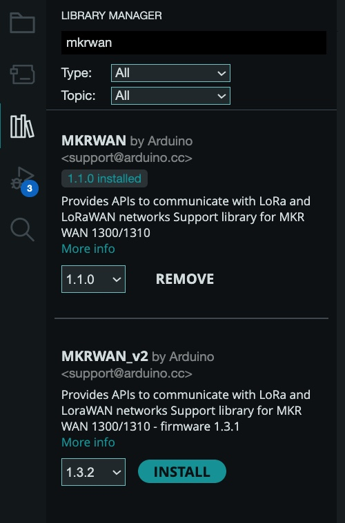

# EXO Sonde to LoRaWAN Bridge

This project reads data from an [EXO sonde (YSI/Xylem)](https://www.xylem.com/siteassets/brand/ysi/resources/manual/exo-user-manual-web.pdf) via 
Modbus RTU and transmits the data over LoRaWAN using an [**Arduino MKR WAN 1310**](https://store.arduino.cc/products/arduino-mkr-wan-1310) 
board + [antenna](https://store.arduino.cc/products/dipole-pentaband-waterproof-antenna).

---

## Directory Set Up

- [codec](./codec/): contains the decoder in python.
- [main](./main/): contains the main source code for the arduino mkrwan 1310. If deploying, set `DEBUG` to false.

## Description

The system periodically reads parameters from the EXO sonde, extracting valid sensor values. These values are packed into a structured LoRaWAN payload including:

- Hardware/software version 
- Device ID
- Date and time of measurement
- Sampling period
- Valid parameter values (up to 30)
- CRC byte for data integrity

The payload is transmitted over a LoRaWAN network using OTAA.

---

## Connections

- **EXO Sonde** connected to **Signal Output Adapter for EXO Sonde** 
- **Arduino**: `VCC`, `GND`, `14-TX`, `13-RX` connected to Signal Adapter (hardware `Serial1` for communication with EXO sonde)
- For monitoring/debugging: **Laptop** connected to the Arduino via USB (hardware default `Serial` interface) 
>NOTE: monitoring/debugging is only used if `DEBUG = True` in main.ino (Default is false).
---

## Requirements

### Arduino Libraries:

- [`SensorModbusMaster`](https://github.com/EnviroDIY/SensorModbusMaster)
- [`CRC`](https://github.com/RobTillaart/CRC)
- [`MKRWAN`](https://docs.arduino.cc/libraries/mkrwan)

Install via the [Arduino IDE](https://www.arduino.cc/en/software/) Library Manager.

---

## Installing Software

1. To connect to the `MKR WAN 1310` board, you will need to install the [Arduino IDE](https://support.arduino.cc/hc/en-us/articles/360019833020-Download-and-install-Arduino-IDE)
1. Once you installed the IDE, you need to further install the board's software support by following the [SAMD21 core for MKR boards Documentation](https://docs.arduino.cc/software/ide-v1/tutorials/getting-started/cores/arduino-samd)

   
1. You will also need the library for mkrwan. Under Library Manager, look up "mkrwan" and install `MKRWAN by Arduino`.

   
    
    >NOTE: At the time of configuring the board `MKRWAN_v2` was not used because of bug issues related to the library.

1. Install the additional libraries listed in [Arduino Libraries](#arduino-libraries)

---

## Configuration

1. Device ID, HW/SW version and MAX_PAYLOAD_SIZE required (in `main.ino`).

1. LoRaWAN credentials required (in `arduino_secrets.h`):

```cpp
#define SECRET_APP_KEY "xxxxxxxxxxxxxxxxxxxxxxxxxxxxxxxx"
```
>NOTE: If you are using Chirpstack you can follow their documentation on how to add devices and generate the app key: https://www.chirpstack.io/docs/guides/connect-device.html

## Serial Output Example

```
Sample period: 120
idx  Code   Status   Raw 16-bit register values
0    51     0        (DATE) 4240 4857
1    54     0        (TIME) 2180 4815
3    230    0	     49E9 413D
...

Number of valid parameters: 23
Bytes required for parameters: 138

Payload (HEX): 
00 00 12 40 42 57 48 57 48 80 21 78 ... [sensor values] ... CRC
```
>NOTE: Serial Ouput is only on if `DEBUG = True` in main.ino (Default is false).
---

## LoRaWAN Payload Structure

The LoRaWAN payload will be divided into multiple packets, each conforming to the MAX_PAYLOAD_SIZE limit and including a Header and CRC.

```
-------------- HEADER --------------
[0]   -> Reserved byte
[1]   -> HW/SW version
[2]   -> Device ID
[3-6] -> Date (4 bytes - 2 Modbus registers)
[7-10] -> Time (4 bytes - 2 Modbus registers)
-------------- PAYLOAD --------------
[11-13] -> Sampling period (3 bytes: 1 code (0) + 2 value) (on first packet)
[14-(N-1)] -> Valid parameters (6 bytes each: 1 code + 1 status + 4 values)
-------------- CRC --------------
[N]   -> CRC8 byte
```

### Date/Time

The MKRWAN firmware extracts date and time from the EXO Sonde using Modbus registers **51** (date) and **54** (time). To ensure accurate timestamping, these registers must always remain enabled. During `setup()`, the MKRWAN automatically checks and enforces this requirement. If the EXO Sonde has already reached its maximum limit of **32 enabled parameters**, the MKRWAN will remove the last two parameters in the list to make room for the required date and time registers.

## Heartbeat Measurement

A heartbeat signal will always be transmitted and **cannot be disabled**, even when no data is being collected from the EXO Sonde. This signal is a 1-byte value that starts at 1 and increments to 255, then wraps back to 1. The heartbeat is a custom parameter specifically designed to monitor the EXO Sonde to LoRaWAN Bridge. It is not part of Xylem’s official EXO Sonde documentation.

| Parameter | Code |
| --------- | ---- |
| Heartbeat | 255  |

> **Note:** If the heartbeat resets to 1 before reaching 255, this indicates that the MKR WAN 1310 has been restarted.

## LED Status

The MKRWAN 1310 uses the built-in LED (pin 6) to indicate system status:

| State                        | Pattern Description           | Function                  |
| ---------------------------- | ----------------------------- | ------------------------- |
| **Join Success**             | 5 fast flashes                | `blinkJoinPassed()`           |
| **Join Failure**             | 3 long flashes with pause     | `blinkJoinFailed()`           |
| **Sensor Read Success**      | 2 short flashes               | `blinkSensorReadPassed()` |
| **Sensor Read Failure**      | 2 medium flashes              | `blinkSensorReadFailed()` |
| **LoRaWAN TX Success**       | 3 fast flashes                | `blinkTxPassed()`         |
| **LoRaWAN TX Failure**       | 4 slow flashes                | `blinkTxFailed()`         |
| **Waiting** | 1 brief flash | `blinkWaiting()`          |

All functions are defined in `main.ino`.

## Downlink Command Structure

The device supports several LoRaWAN downlink commands for remote configuration and control. Downlink messages follow a simple command-based structure, where the **first byte indicates the command type**, and the **subsequent bytes contain any associated parameters**.

Each command is processed immediately after uplink transmission or upon receiving a downlink. Commands must follow these structures:

---

### **Command 0x01: Change LoRaWAN Transmit Period**

**Purpose:** Updates how often the device sends uplink packets over LoRaWAN.  
**Structure:**  
This is in little endian format.
```
[0x01][<Low Byte of Period>][<High Byte of Period>]
```
**Length:** 3 bytes  
**Details:**
- Period must be between **60 and 7200 seconds** (1 minute to 2 hours).
- Internally, this also updates the adapter’s sample period to half the transmit period, bounded between 15 and 3600 seconds.

**Chirpstack Hex Format Example:**  
To set a 10-minute (600-second) transmit period:  
```
015802  →  5802 = 600
```
- fport=1
- confirm=true
---

### **Command 0x02: Force Sample**

**Purpose:** Triggers an immediate sample on the adapter and sends a LoRaWAN uplink with the latest data.  
**Structure:**  
```
[0x02]
```
**Length:** 1 byte  
**Details:**
- The adapter is sent a force sample command (via Modbus register 1).
- The firmware waits 15 seconds before reading new values.
- The FORCE_SAMPLE flag bypasses the usual transmit wait cycle.
>NOTE: the firmware takes 15 seconds since it takes 15 seconds for the exosonde to fill the registers with the new values.

**Chirpstack Hex Format Example:**  
To force the mkrwan 1310 to sample:  
```
02
```
- fport=1
- confirm=true
---

### **Command 0x03: Force Wipe**

**Purpose:** Commands the adapter to run the sonde’s mechanical wiper (if available).  
**Structure:**  
```
[0x03]
```
**Length:** 1 byte  
**Details:**
- This writes a value to Modbus register 2 to activate the wipe.

**Chirpstack Hex Format Example:**  
To force the mkrwan 1310 to wipe:  
```
03
```
- fport=1
- confirm=true
---

### **Command 0x04: Change Parameter Types**

**Purpose:** Dynamically reconfigures which sonde parameters the adapter provides.  
**Structure:**  
```
[0x04][Param1][Param2]...[ParamN]
```
**Length:** 2–33 bytes  
**Details:**
- Supports up to **32 parameter codes**.
- Each parameter code is 1 byte (from the [parameter code list](#available-parameter-codes)).
- Writing ends with a **terminating 0** to signal the end of the parameter list (handled automatically).
- Invalid codes are ignored, and the entire command is rejected on error.

**Chirpstack Hex Format Example:**  
To request:  
- Temperature (code 1)  
- pH (code 18)  
- Turbidity (code 37)
- Date (code 51)
- Time (code 54)
Send:  
```
040112253336
```
- fport=1
- confirm=true

>NOTE: Always include code 51 and 54 in the parameter list when changing the parameter types. These codes are the date and time registers that are used in the packet header.
---

### **Command 0x05: Force Mkrwan 1310 reboot**
**Purpose:** Reboot the arduino Mkrwan

**Structure:**  
```
[0x05]
```
**Length:** 1 byte 

**Details:**
- Run with caution, rebooting the mkrwan causes it to disconnect from the network and retry the join request.

**Chirpstack Hex Format Example:**  
To force the mkrwan 1310 to reboot:  
```
05
```
- fport=1
- confirm=true

---

### Example Downlink Commands (Hex Format)

| Command Description                  | Command Code | Chirpstack Hex Format Example | Notes                                                                                |
| ------------------------------------ | ------------ | --------------------------- | ------------------------------------------------------------------------------------ |
| **Change Transmit Period**           | `0x01`       | `012C01`                  | Sets transmit period to **300 sec** (`0x012C`). Format: `01 [LOW_BYTE] [HIGH_BYTE]`. |
| **Force Sample**                     | `0x02`       | `02`                        | Triggers a new sensor sample immediately.                                            |
| **Force Wipe**                       | `0x03`       | `03`                        | Initiates a wiper clean cycle on the sensor.                                         |
| **Change Parameter Types**   | `0x04`       | `040112253336`      | Sends parameter codes: 4, 1, 18, 37, 51, 54.                                         |
| **Change Parameter Types (Reset Registers)**   | `0x04`       | `043336`      | Sends parameter codes 51, 54, and zero out the remaining registers.       |
| **Force Mkrwan 1310 reboot**         | `0x05`       | `05`                        | Reboots the MKR WAN 1310 device.                                                     |
| **Invalid Command**                  | `0xFF`       | `FF`                        | Handled as unknown command in firmware.  

#### Format Breakdown

* First byte is always the **command code**:

  * `0x01`: Change transmit period
  * `0x02`: Force sample
  * `0x03`: Force wipe
  * `0x04`: Change parameter types
  * `0x05`: Force reboot

* Payloads after the command code vary:

  * For `0x01`: 2 bytes (little endian) for new transmit interval.
  * For `0x04`: Up to 32 parameter codes (1 byte each, from 1 to 243).

####  Notes

- All numeric values are sent in **little-endian** format where applicable.
- Commands are handled immediately after uplink completion to ensure synchronization with the adapter’s update cycle.
- Always include code 51 and 54 in the parameter list when changing the parameter types. These codes are the date and time registers that are used in the packet header.

## Available Parameter Codes

| Parameter                             | Code |
|---------------------------------------|------|
| Temperature, °C                       | 1    |
| Temperature, °F                       | 2    |
| Temperature, K                        | 3    |
| Conductivity, mS/cm                   | 4    |
| Conductivity, μS/cm                   | 5    |
| Specific Conductance, mS/cm          | 6    |
| Specific Conductance, μS/cm          | 7    |
| TDS, g/L                              | 10   |
| Salinity, PPT                         | 12   |
| pH, mV                                | 17   |
| pH                                    | 18   |
| ORP, mV                               | 19   |
| Pressure, psia                        | 20   |
| Pressure, psig                        | 21   |
| Depth, m                              | 22   |
| Depth, ft                             | 23   |
| Battery, V                            | 28   |
| Turbidity, NTU                        | 37   |
| NH3 (Ammonia), mg/L                   | 47   |
| NH4 (Ammonium), mg/L                  | 48   |
| Date, DDMMYY                          | 51   |
| Date, MMDDYY                          | 52   |
| Date, YYMMDD                          | 53   |
| Time, HHMMSS                          | 54   |
| TDS, kg/L                             | 95   |
| NO3 (Nitrate), mV                     | 101  |
| NO3 (Nitrate), mg/L                   | 106  |
| NH4 (Ammonium), mV                    | 108  |
| TDS, mg/L                             | 110  |
| Chloride, mg/L                        | 112  |
| Chloride, mV                          | 145  |
| TSS, mg/L                             | 190  |
| TSS, g/L                              | 191  |
| Chlorophyll, μg/L                     | 193  |
| Chlorophyll, RFU                      | 194  |
| PAR, Channel 1                        | 201  |
| PAR, Channel 2                        | 202  |
| Rhodamine, μg/L                       | 204  |
| ODO, %Sat                             | 211  |
| ODO, mg/L                             | 212  |
| ODO, %Sat Local                       | 214  |
| TAL-PC, cells/mL                      | 215  |
| BGA-PC, RFU                           | 216  |
| TAL-PE, cells/mL                      | 217  |
| TAL-PE, RFU                           | 218  |
| Turbidity, FNU                        | 223  |
| TAL-PC, μg/L                          | 225  |
| TAL-PE, μg/L                          | 226  |
| fDOM, RFU                             | 227  |
| fDOM, QSU                             | 228  |
| Wiper Position, V                     | 229  |
| External Power, V                     | 230  |
| nLF Conductivity, mS/cm               | 237  |
| nLF Conductivity, μS/cm              | 238  |
| Wiper Peak Current, mA                | 239  |
| Vertical Position, m                  | 240  |
| Vertical Position, ft                 | 241  |
| Chlorophyll, cells/mL                 | 242  |
| NitraLED, mg/L                        | 243  |


>NOTE: Retrieved from [EXO sonde (YSI/Xylem)](https://www.xylem.com/siteassets/brand/ysi/resources/manual/exo-user-manual-web.pdf).